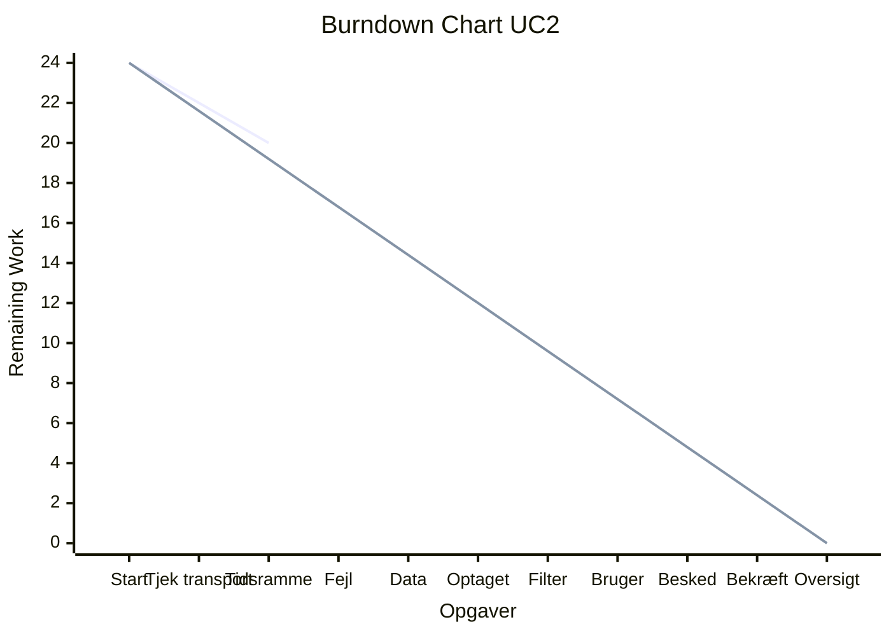
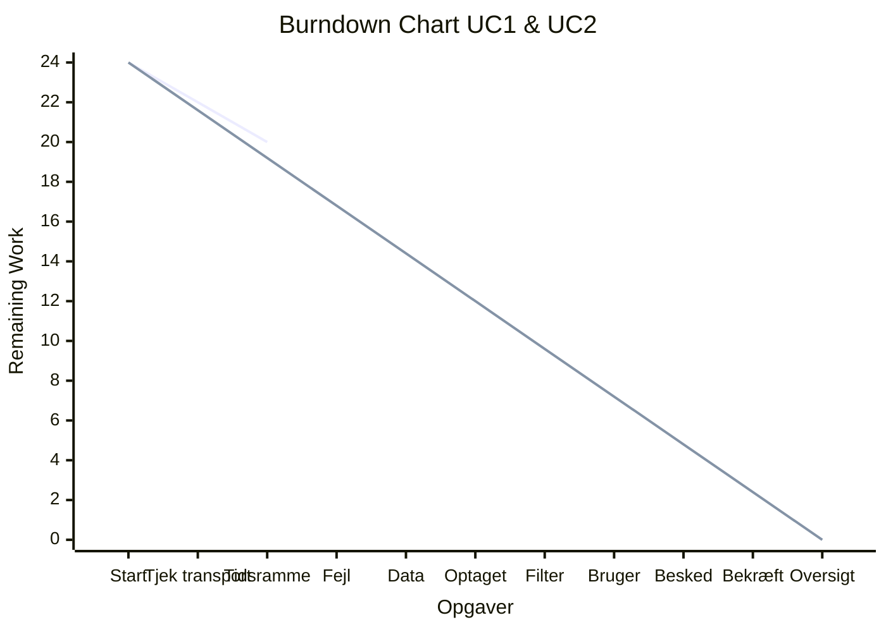

```mermaid
xychart-beta
    title "Burndown Chart UC2"
    x-axis "Opgaver" ["Start","Tjek transport","Tidsramme","Fejl","Data","Optaget","Filter","Bruger","Besked","Bekræft","Oversigt"]
    y-axis "Remaining Work" 0 --> 24
    line "Actual" [24, 22, 20]
    line "Ideal" [24,21.6,19.2,16.8,14.4,12,9.6,7.2,4.8,2.4,0]
```

```mermaid
xychart-beta
    title "Burndown Chart UC1 & UC2"
    x-axis "Opgaver" ["Start","Tjek transport","Tidsramme","Fejl","Data","Optaget","Filter","Bruger","Besked","Bekræft","Oversigt"]
    y-axis "Remaining Work" 0 --> 24
    line "Actual" [24, 22, 20]
    line "Ideal" [24,21.6,19.2,16.8,14.4,12,9.6,7.2,4.8,2.4,0]
```