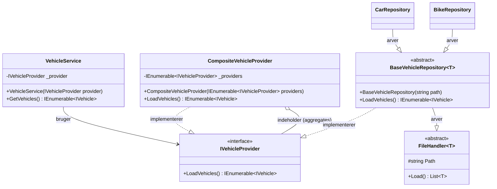
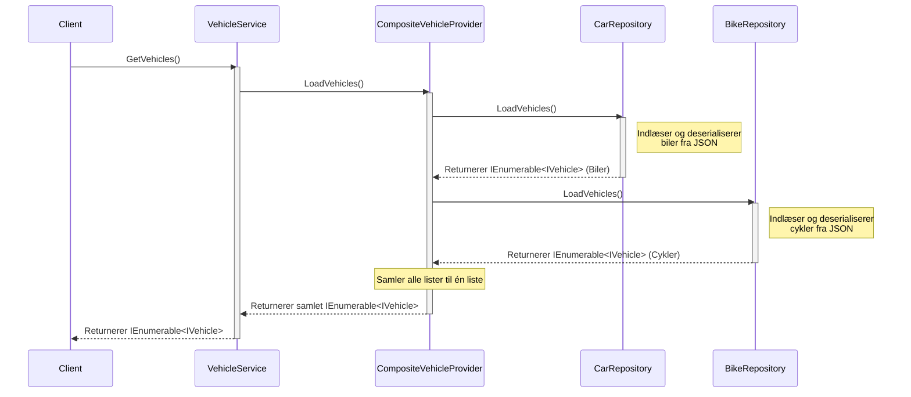
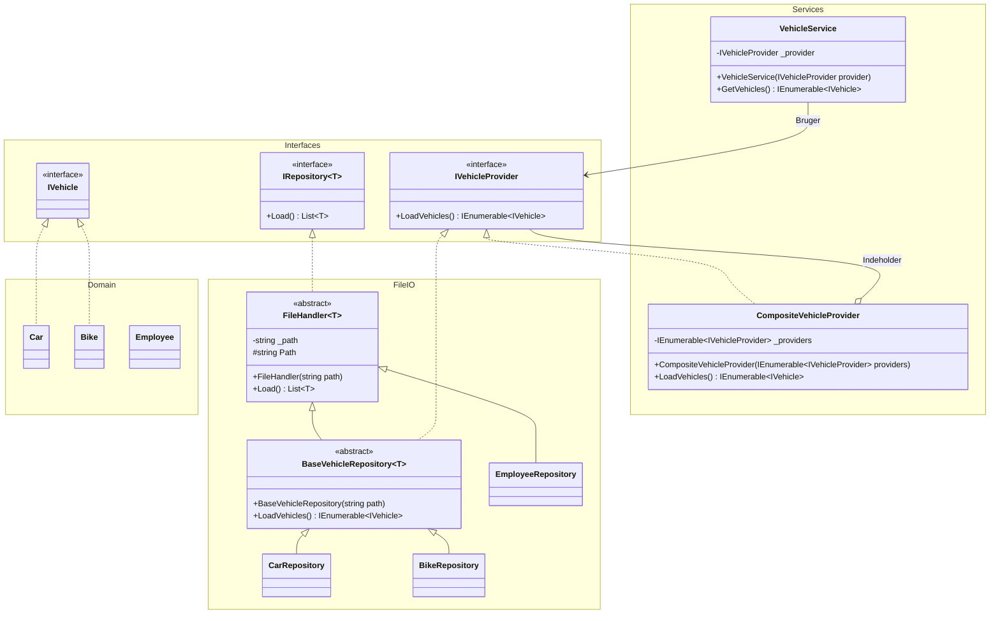

# System Architecture - Composite Pattern

Dette dokument indeholder et statisk og et dynamisk UML-diagram, der viser den nye arkitektur efter implementeringen af Composite Pattern for `IVehicleProvider`.

## 1. Statisk Diagram (Klassediagram)

Dette klassediagram viser, hvordan Composite-mønsteret er bygget op. `CompositeVehicleProvider` og de specifikke repositories (`CarRepository`, `BikeRepository` via `BaseVehicleRepository`) implementerer alle samme `IVehicleProvider` interface. `CompositeVehicleProvider` fungerer som en container, der samler flere providers, og `VehicleService` kender nu udelukkende til ét `IVehicleProvider` objekt.

## 2. Dynamisk Diagram (Sekvensdiagram)

Dette sekvensdiagram viser det dynamiske flow, når klienten (f.eks. brugergrænsefladen) anmoder om køretøjer. `VehicleService` kalder nu blot `LoadVehicles()` på dens ene provider (som her er `CompositeVehicleProvider`). Compositen itererer over dens egne under-providers, kalder `LoadVehicles()` på dem og samler resultaterne.

## 3. Komplet Statisk Diagram over nuværende implementering

Dette diagram viser hele den nuværende implementering, herunder domænemodeller og FileIO/Repository-klasser, i én samlet visning.

