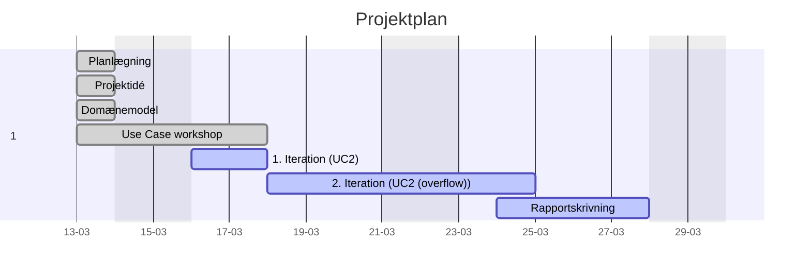
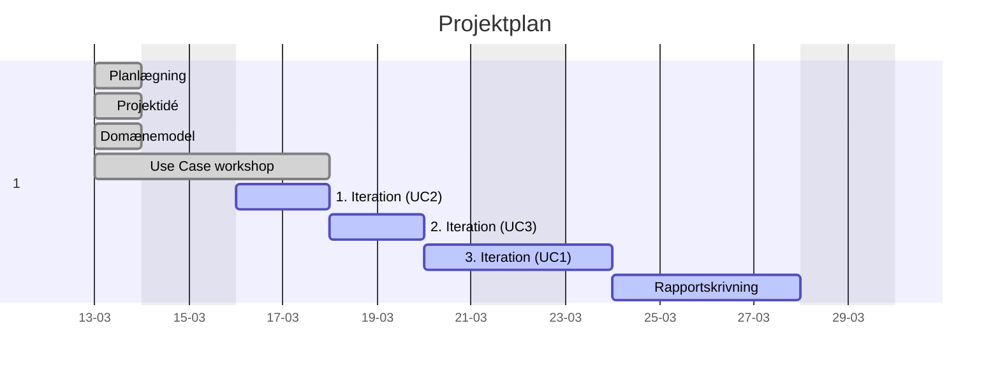
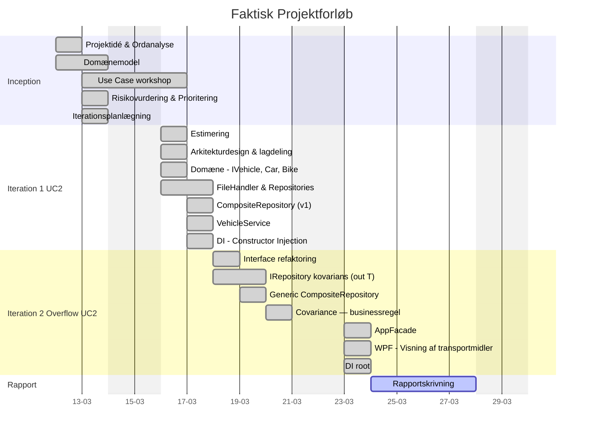
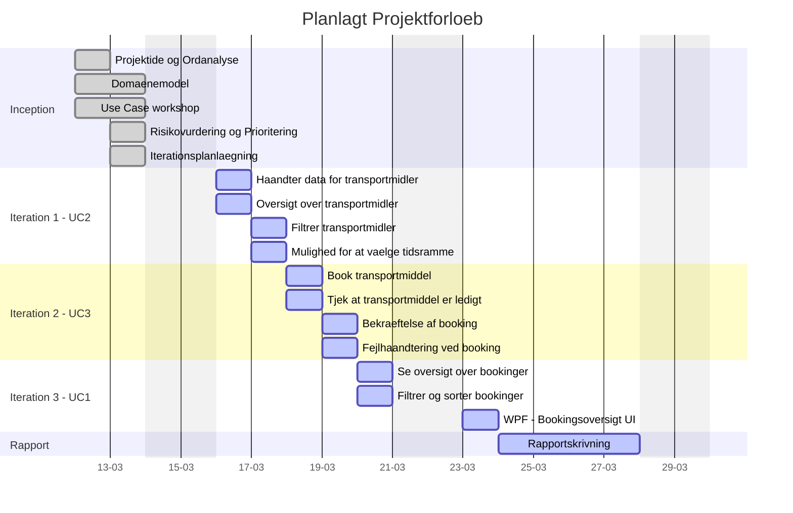

### Faktisk process:

```mermaid
gantt
    title Projektplan
    dateFormat  YYYY-MM-DD
    axisFormat  %d-%m
    excludes weekends

    section 1
    Planlægning          :done,    p1, 2026-03-13, 1d
    Projektidé           :done,    p1, 2026-03-13, 1d
	Domænemodel          :done,    p1, 2026-03-13, 1d
	Use Case workshop    :done,    p1, 2026-03-13, 3d
	1. Iteration (UC2)   :active,  p1, 2026-03-16, 2d
	2. Iteration (UC2 (overflow))   :active,  p1, 2026-03-18, 5d
	Rapportskrivning     :active,  p1, 2026-03-24, 4d


    
```
### Planlangt process:

```mermaid
gantt
    title Projektplan
    dateFormat  YYYY-MM-DD
    axisFormat  %d-%m
    excludes weekends

    section 1
    Planlægning          :done,    p1, 2026-03-13, 1d
    Projektidé           :done,    p1, 2026-03-13, 1d
	Domænemodel          :done,    p1, 2026-03-13, 1d
	Use Case workshop    :done,    p1, 2026-03-13, 3d
	1. Iteration (UC2)   :active,  p1, 2026-03-16, 2d
	2. Iteration (UC3)   :active,  p1, 2026-03-18, 2d
	3. Iteration (UC1)   :active,  p1, 2026-03-20, 2d
	Rapportskrivning     :active,  p1, 2026-03-24, 4d


    
```

```mermaid
 gantt
      title Faktisk Projektforløb
      dateFormat  YYYY-MM-DD
      axisFormat  %d-%m
      excludes weekends

      section Inception
      Projektidé & Ordanalyse          :done, 2026-03-12, 1d
      Domænemodel                      :done, 2026-03-12, 2d
      Use Case workshop                :done, 2026-03-13, 2d
      Risikovurdering & Prioritering   :done, 2026-03-13, 1d
      Iterationsplanlægning            :done, 2026-03-13, 1d

      section Iteration 1 UC2
      Estimering                       :done, 2026-03-16, 1d
      Arkitekturdesign & lagdeling     :done, 2026-03-16, 1d
      Domæne - IVehicle, Car, Bike     :done, 2026-03-16, 1d
      FileHandler & Repositories       :done, 2026-03-16, 2d
      CompositeRepository (v1)         :done, 2026-03-17, 1d
      VehicleService                   :done, 2026-03-17, 1d
      DI - Constructor Injection       :done, 2026-03-17, 1d

      section Iteration 2 Overflow UC2
      Interface refaktoring            :done, 2026-03-18, 1d
      IRepository kovarians (out T)    :done, 2026-03-18, 2d
      Generic CompositeRepository      :done, 2026-03-19, 1d
      Covariance — businessregel       :done, 2026-03-20, 1d
      AppFacade                        :done, 2026-03-23, 1d
      WPF - Visning af transportmidler :done, 2026-03-23, 1d
      DI root                          :done, 2026-03-23, 1d

      section Rapport
      Rapportskrivning                 :active, 2026-03-24, 4d
```

```mermaid
gantt
      title Planlagt Projektforloeb
      dateFormat  YYYY-MM-DD
      axisFormat  %d-%m
      excludes weekends

      section Inception
      Projektide og Ordanalyse         :done, 2026-03-12, 1d
      Domaenemodel                     :done, 2026-03-12, 2d
      Use Case workshop                :done, 2026-03-12, 2d
      Risikovurdering og Prioritering  :done, 2026-03-13, 1d
      Iterationsplanlaegning           :done, 2026-03-13, 1d

      section Iteration 1 - UC2
      Haandter data for transportmidler :active, 2026-03-16, 1d
      Oversigt over transportmidler    :active, 2026-03-16, 1d
      Filtrer transportmidler          :active, 2026-03-17, 1d
      Mulighed for at vaelge tidsramme :active, 2026-03-17, 1d

      section Iteration 2 - UC3
      Book transportmiddel             :active, 2026-03-18, 1d
      Tjek at transportmiddel er ledigt :active, 2026-03-18, 1d
      Bekraeftelse af booking          :active, 2026-03-19, 1d
      Fejlhaandtering ved booking      :active, 2026-03-19, 1d

      section Iteration 3 - UC1
      Se oversigt over bookinger       :active, 2026-03-20, 1d
      Filtrer og sorter bookinger      :active, 2026-03-20, 1d
      WPF - Bookingsoversigt UI        :active, 2026-03-23, 1d

      section Rapport
      Rapportskrivning                 :active, 2026-03-24, 4d
```