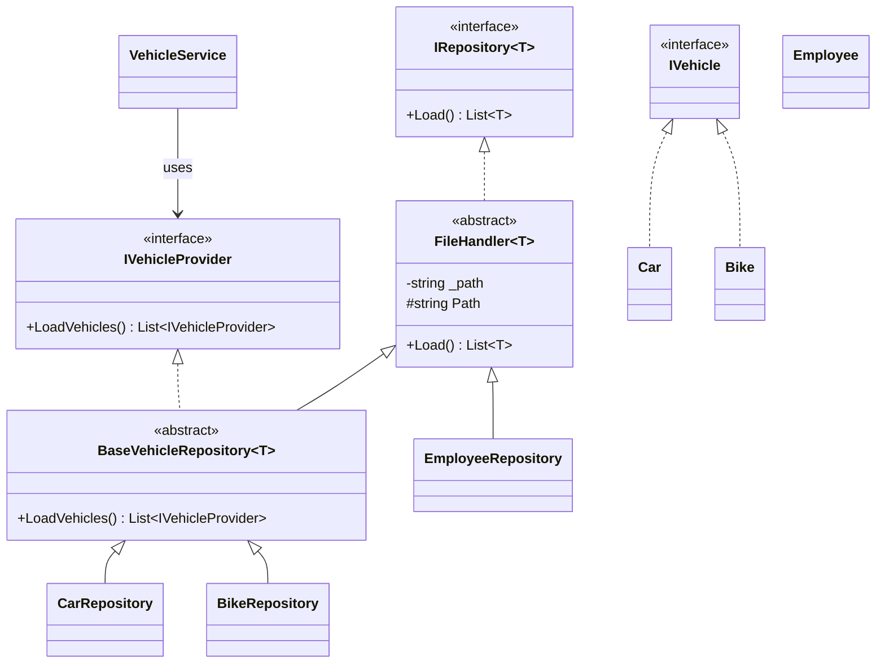
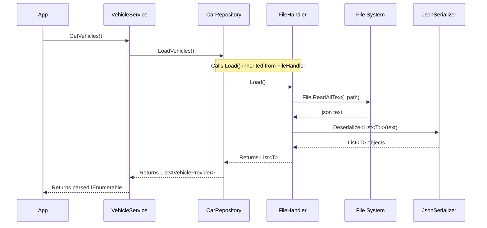

# System Architecture

This document contains static and dynamic models of the current system architecture based on the existing solution.

## 1. Static Diagram (Class Diagram)

This standard Mermaid class diagram maps out the core relationships between your domain models, repositories, and interfaces based on your file structure.

## 2. Dynamic Diagram (Standard Mermaid Sequence)

This sequence diagram illustrates a standard program flow of getting vehicles loaded from the file system.

